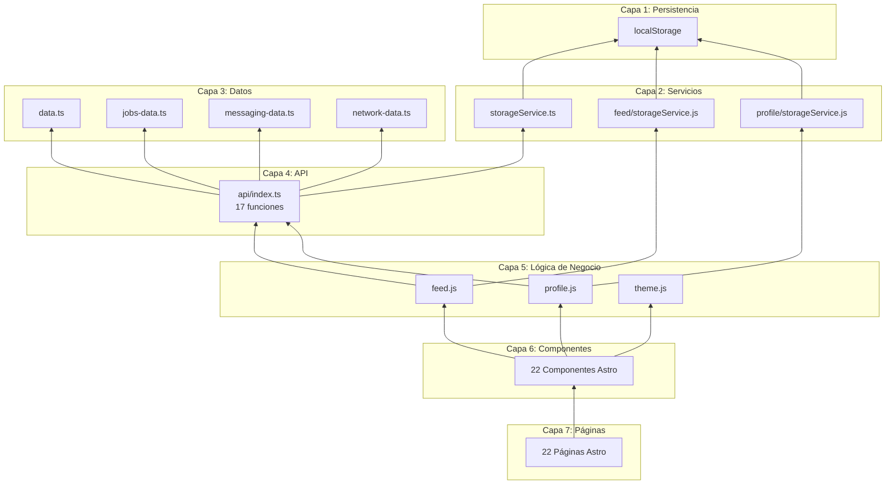

# LinkedIn Lite

<div align="center">


**Un clon completo y funcional de LinkedIn construido con tecnologías web modernas**

[](https://astro.build)
[](https://www.typescriptlang.org/)
[](https://tailwindcss.com)
[](https://vercel.com)

[Demo en Vivo](#) • [Documentación](./docs) • [Reportar Bug](#) • [Solicitar Feature](#)

</div>

---

## 📋 Tabla de Contenidos

- [Sobre el Proyecto](#-sobre-el-proyecto)
- [Características Principales](#-características-principales)
- [Stack Tecnológico](#-stack-tecnológico)
- [Instalación](#-instalación)
- [Estructura del Proyecto](#-estructura-del-proyecto)
- [Arquitectura](#-arquitectura)
- [Documentación](#-documentación)
- [Roadmap](#-roadmap)
- [Licencia](#-licencia)

---

## 🎯 Sobre el Proyecto

**LinkedIn Lite** es una red social profesional completamente funcional que replica las características principales de LinkedIn. Construido como un MVP moderno, demuestra cómo crear aplicaciones web complejas y escalables usando tecnologías ligeras y estándares web.

### ¿Por qué LinkedIn Lite?

- ✅ **MVP Completo**: Todas las funcionalidades core de una red social profesional
- ✅ **Arquitectura Escalable**: Diseñado para evolucionar a sistemas de producción
- ✅ **Performance Optimizado**: Carga rápida y experiencia fluida sin frameworks pesados
- ✅ **Sin Backend Complejo**: Usa localStorage como capa de datos (fácilmente reemplazable)
- ✅ **Diseño Responsive**: Funciona perfectamente en móvil, tablet y desktop
- ✅ **Código Limpio**: TypeScript + patrones de diseño modernos

### Casos de Uso

Este proyecto es ideal para:
- 🎓 **Aprendizaje**: Estudiar arquitecturas web modernas sin frameworks complejos
- 💼 **Portfolio**: Demostrar habilidades full-stack con un proyecto real
- 🚀 **Prototipado Rápido**: Base para validar ideas de productos sociales
- 🏗️ **Referencia Arquitectónica**: Patrones de diseño escalables y mantenibles

---

## ✨ Características Principales

### 🔄 Sistema de Feed Dinámico

- **Publicaciones Interactivas**: Crea, edita y elimina posts con texto e imágenes
- **Reacciones Múltiples**: 3 tipos de reacciones (👍 Like, 👏 Clap, 💡 Interesting)
- **Comentarios**: Sistema completo de comentarios por post
- **Ordenamiento Inteligente**: Ordena por más reciente o más popular
- **Actualizaciones en Tiempo Real**: UI optimista sin recargas de página
- **Persistencia Automática**: Todos los cambios guardados en localStorage

### 👤 Gestión de Perfil Completa

- **Edición de Biografía**: Editor de texto enriquecido con previsualización
- **Gestión de Habilidades**: Agregar, editar y eliminar skills con badges visuales
- **Timeline de Experiencia**: CRUD completo de experiencia laboral
  - Título de puesto, empresa, fechas
  - Descripción detallada de responsabilidades
  - Vista de timeline profesional
- **Foto de Perfil**: Soporte para avatar personalizado
- **Estadísticas**: Conexiones, visualizaciones de perfil, impresiones

### 💼 Portal de Empleos

- **Listado de Empleos**: 8+ ofertas laborales completas con detalles
- **Filtros Avanzados**: Por tipo (remoto, híbrido, presencial), nivel, empresa
- **Páginas de Detalle**: Información completa de cada empleo
- **Sistema de Aplicaciones**: Aplica a empleos con seguimiento de estado
- **Guardar Empleos**: Marca empleos para revisión posterior
- **Búsqueda**: Encuentra empleos por palabra clave

### 💬 Sistema de Mensajería

- **Conversaciones Privadas**: Chat 1-a-1 con otros usuarios
- **Lista de Conversaciones**: Vista general con últimos mensajes
- **Estado en Tiempo Real**: Indicadores de mensajes no leídos
- **Interfaz de Chat**: Burbujas de mensaje con timestamps
- **Envío Instantáneo**: Actualización optimista de mensajes

### 🌐 Red y Conexiones

- **Sugerencias de Conexión**: Usuarios recomendados para conectar
- **Invitaciones**: Sistema completo de solicitudes de conexión
  - Enviar invitaciones
  - Aceptar/rechazar solicitudes
  - Contador de invitaciones pendientes
- **Gestión de Red**: Vista de todas tus conexiones
- **Estadísticas de Red**: Visualiza el crecimiento de tu red

### 🔔 Centro de Notificaciones

- **8 Tipos de Notificaciones**:
  - Nuevas conexiones
  - Comentarios en posts
  - Reacciones a publicaciones
  - Menciones
  - Invitaciones aceptadas
  - Actualizaciones de empleo
  - Mensajes nuevos
  - Aniversarios de conexiones
- **Filtrado por Tipo**: Filtra notificaciones por categoría
- **Estado de Lectura**: Marca como leído/no leído
- **Badge de Contador**: Indicador visual de notificaciones nuevas

### 🔍 Búsqueda Global

- **Búsqueda Universal**: Busca usuarios, posts, empleos en un solo lugar
- **Filtros por Tipo**: Filtra resultados por categoría
- **Resultados Relevantes**: Búsqueda por palabras clave en múltiples campos
- **Navegación Rápida**: Accede directamente desde la navbar

### ⭐ Features Premium

- **Página Premium**: Información sobre características premium
- **Planes de Suscripción**: Diferentes niveles de membership
- **Beneficios Destacados**: Listado de ventajas premium

### 💾 Elementos Guardados

- **Guardar Posts**: Guarda publicaciones para leer después
- **Guardar Empleos**: Marca empleos de interés
- **Vista Unificada**: Todos los items guardados en un solo lugar
- **Gestión Fácil**: Elimina items guardados con un click

### 🌙 Modo Oscuro Profesional

- **Detección Automática**: Respeta la preferencia del sistema
- **Toggle Manual**: Cambia entre claro/oscuro con un click
- **Transiciones Suaves**: Animaciones CSS de 200ms
- **Persistencia**: Preferencia guardada entre sesiones
- **Colores Optimizados**: Paleta cuidadosamente seleccionada para cada modo

### 📱 Diseño 100% Responsive

- **Mobile-First**: Optimizado primero para móviles
- **Breakpoints Inteligentes**: Adaptación fluida en tablet
- **Desktop Completo**: Aprovecha pantallas grandes con sidebars
- **Touch-Friendly**: Botones y áreas de click optimizadas para táctil

---

## 🛠️ Stack Tecnológico

### Core Technologies

| Tecnología | Versión | Propósito |
|-----------|---------|-----------|
| **[Astro](https://astro.build)** | 5.16.9 | Framework principal - Zero JS by default |
| **[TypeScript](https://www.typescriptlang.org/)** | 5.9.3 | Type safety y mejor DX |
| **[TailwindCSS](https://tailwindcss.com)** | 4.1.18 | Framework CSS utility-first |
| **Vanilla JavaScript** | ES2022+ | Lógica client-side sin frameworks |

### Deployment & Tooling

- **[Vercel](https://vercel.com)**: Hosting y edge runtime
- **[pnpm](https://pnpm.io)**: Package manager (10.0.0)
- **[@astrojs/check](https://www.npmjs.com/package/@astrojs/check)**: Validación de tipos
- **[@astrojs/vercel](https://www.npmjs.com/package/@astrojs/vercel)**: Adapter de Vercel

### ¿Por qué este Stack?

#### Astro 5.16.9
- **Zero JavaScript por defecto**: Solo carga JS donde es necesario
- **Hybrid Rendering**: SSG para páginas estáticas + SSR para dinámicas
- **File-based Routing**: Estructura intuitiva y escalable
- **Component Islands**: Arquitectura de micro-frontends moderna
- **Performance Superior**: Core Web Vitals excelentes out-of-the-box

#### TailwindCSS 4.1.18
- **Desarrollo Rápido**: Clases utility para prototipado veloz
- **Consistencia Visual**: Design tokens y sistema de diseño unificado
- **Bundle Size Mínimo**: Purging automático de CSS no usado
- **Dark Mode Built-in**: Soporte nativo para temas
- **Responsive by Design**: Mobile-first con breakpoints claros

#### TypeScript + Vanilla JS
- **Type Safety**: Interfaces y tipos para prevenir errores
- **Mejor DX**: Autocomplete e IntelliSense en IDE
- **Sin Overhead**: Vanilla JS = 0 KB de framework en el bundle
- **Performance Óptima**: Sin abstracciones innecesarias
- **Compatibilidad Universal**: Funciona en todos los navegadores modernos

#### localStorage como Persistencia
- **Prototipado Rápido**: No requiere backend inicialmente
- **Offline-First**: Funciona sin conexión
- **Fácil Migración**: Arquitectura preparada para API real
- **Desarrollo Simplificado**: Testing sin infraestructura compleja

---

## 🚀 Instalación

### Prerrequisitos

Asegúrate de tener instalado:
- **Node.js** >= 18.0.0
- **pnpm** >= 8.0.0 (recomendado) o npm/yarn

### Instalación Rápida

```bash
# Clonar el repositorio
git clone https://github.com/tu-usuario/linkedIn-lite.git
cd linkedIn-lite

# Instalar dependencias
pnpm install

# Iniciar servidor de desarrollo
pnpm dev
```

La aplicación estará disponible en **http://localhost:4321**

### Scripts Disponibles

```bash
# Desarrollo (con hot reload)
pnpm dev

# Build de producción
pnpm build

# Preview del build de producción
pnpm preview

# Type-check sin build
pnpm astro check
```

### Variables de Entorno

Este proyecto no requiere variables de entorno para funcionar. Toda la configuración está en `astro.config.mjs`.

Para deployment en Vercel, no se requiere configuración adicional.

---

## 📁 Estructura del Proyecto

### Vista General

```
linkedIn-lite/
├── src/                      # Código fuente principal
│   ├── components/          # 22 componentes Astro reutilizables
│   ├── layouts/             # Layout principal de las páginas
│   ├── pages/               # 22 páginas con file-based routing
│   ├── lib/                 # Lógica de negocio y módulos
│   ├── services/            # Servicios de persistencia
│   ├── types/               # Definiciones TypeScript
│   └── styles/              # Estilos globales y CSS variables
├── public/                   # Assets estáticos (imágenes, favicons)
├── docs/                     # Documentación del proyecto
└── [archivos de config]     # astro.config.mjs, tsconfig.json, etc.
```

### Detalle de Directorios

#### `/src/components` - Componentes Reutilizables (22)

Organizados por funcionalidad:

**Navegación (4)**
```
components/
├── Navbar.astro              # Barra de navegación principal
├── ThemeToggle.astro         # Toggle de tema light/dark
├── ProfileSidebar.astro      # Sidebar izquierdo con perfil
└── RightSidebar.astro        # Sidebar derecho con sugerencias
```

**Feed (3)**
```
components/
├── Post.astro                # Componente principal de post
├── CreatePostModal.astro     # Modal para crear posts
└── SkeletonPost.astro        # Loading skeleton animado
```

**Perfil (4)**
```
components/
├── ProfileCard.astro         # Tarjeta completa de perfil
├── ExperienceCard.astro      # Container de experiencia
├── ExperienceItem.astro      # Item individual de experiencia
└── SkillBadge.astro          # Badge de habilidad
```

**Networking (2)**
```
components/
├── ConnectionCard.astro      # Tarjeta de conexión sugerida
└── InvitationCard.astro      # Invitación de conexión
```

**Mensajería (2)**
```
components/
├── ConversationItem.astro    # Item en lista de conversaciones
└── MessageBubble.astro       # Burbuja de mensaje individual
```

**Jobs (2)**
```
components/
├── JobCard.astro             # Tarjeta de oferta laboral
└── SavedJobItem.astro        # Trabajo guardado
```

**Utilidades (5)**
```
components/
├── NotificationItem.astro    # Notificación individual
├── Spinner.astro             # Indicador de carga
├── SearchResults.astro       # Resultados de búsqueda
├── Comments.astro            # Sistema de comentarios
└── Welcome.astro             # Página de bienvenida
```

#### `/src/pages` - Páginas (22)

Routing file-based de Astro:

```
pages/
├── index.astro                    # 🏠 Feed principal (home)
├── profile.astro                  # 👤 Perfil de usuario
├── search.astro                   # 🔍 Búsqueda global
├── notifications.astro            # 🔔 Centro de notificaciones
├── saved.astro                    # 💾 Items guardados
├── premium.astro                  # ⭐ Página premium
│
├── jobs/                          # 💼 Portal de empleos
│   ├── index.astro               # Listado de empleos
│   └── [id].astro                # Detalle de empleo (SSR)
│
├── messages/                      # 💬 Sistema de mensajería
│   ├── index.astro               # Lista de conversaciones
│   └── [id].astro                # Chat individual (SSR)
│
└── network/                       # 🌐 Red y conexiones
    ├── index.astro               # Mi red
    └── invitations.astro         # Invitaciones pendientes
```

**Páginas Estáticas (16)**: Se generan en build time (SSG)
**Páginas Dinámicas (6)**: Usan SSR con parámetros `[id]`

#### `/src/lib` - Lógica de Negocio (17 archivos)

```
lib/
├── feed/                          # Sistema de feed
│   ├── feed.js                   # Lógica de renderizado y ordenamiento
│   ├── reactions.js              # Sistema de reacciones (like, clap, etc.)
│   └── storageService.js         # Persistencia de posts
│
├── profile/                       # Sistema de perfil
│   ├── profile.js                # Gestión de perfil editable
│   └── storageService.js         # Persistencia de datos de perfil
│
├── theme/                         # Sistema de temas
│   └── theme.js                  # Light/Dark mode con persistencia
│
├── api/                           # Capa de API
│   └── index.ts                  # 17 funciones API mock (lista para backend real)
│
├── data.ts                        # Base de datos mock (users, posts, comments)
├── clientInit.ts                  # Inicialización del cliente
│
└── [archivos de datos]/           # Datos mock por módulo (7 archivos)
    ├── jobs-data.ts              # 8 ofertas laborales
    ├── messaging-data.ts         # Conversaciones y mensajes
    ├── network-data.ts           # Conexiones e invitaciones
    ├── notifications-data.ts     # 8 tipos de notificaciones
    ├── saved-data.ts             # Items guardados
    ├── premium-data.ts           # Features premium
    └── [legacy data]/            # Datos antiguos (en desuso)
```

#### `/src/services` - Servicios de Persistencia

```
services/
└── storageService.ts             # Servicio base de localStorage
                                  # (usado por feed y profile)
```

#### `/src/types` - Definiciones TypeScript

```
types/
├── index.ts                       # 20+ interfaces (Post, User, Job, etc.)
└── env.d.ts                       # Tipos de entorno Astro
```

#### `/src/layouts` - Layouts de Página

```
layouts/
└── Layout.astro                   # Layout principal con navbar y estructura
```

#### `/src/styles` - Estilos Globales

```
styles/
└── global.css                     # CSS variables, reset, animaciones
```

---

## 🏗️ Arquitectura

### Arquitectura en Capas

El proyecto implementa una **arquitectura modular en capas** con separación clara de responsabilidades:



### Flujo de Datos

**Lectura (Carga Inicial)**:
```
Usuario → Página → Componente → Módulo Lógica → API → Datos Mock → localStorage → UI
```

**Escritura (Crear/Actualizar)**:
```
Usuario → Evento UI → Módulo Lógica → Actualización Optimista UI → API → Persistencia → Confirmación
```

### Patrones de Diseño Utilizados

1. **Repository Pattern**: Servicios de storage abstractos
2. **Mock API Pattern**: API simulada lista para backend real
3. **Module Pattern**: Lógica encapsulada en módulos
4. **Optimistic UI**: Actualizaciones inmediatas antes de confirmar
5. **Event Delegation**: Minimiza listeners con data attributes
6. **Layered Architecture**: Separación de responsabilidades en capas

### Preparación para Backend Real

La arquitectura está diseñada para **fácil migración a backend real**:

- ✅ Capa de API claramente separada (`api/index.ts`)
- ✅ 17 funciones API listas para reemplazar con fetch/axios
- ✅ Servicios de storage encapsulados
- ✅ TypeScript interfaces sincronizadas
- ✅ Lógica de negocio independiente de la persistencia

**Pasos para integrar backend**:
1. Reemplazar funciones en `api/index.ts` con llamadas HTTP
2. Actualizar `storageService.ts` para eliminar localStorage
3. Agregar autenticación (JWT/OAuth)
4. Sincronizar interfaces TypeScript con API
5. Implementar error handling y retry logic

---

## 📚 Documentación

El proyecto incluye documentación completa en el directorio `/docs`:

| Documento | Descripción |
|-----------|-------------|
| **[project-overview.md](./docs/project-overview.md)** | Visión general del proyecto, arquitectura de alto nivel, stack tecnológico y roadmap |
| **[frontend.md](./docs/frontend.md)** | Documentación técnica del frontend: componentes, módulos JS, flujos de interacción y patrones |
| **[components.md](./docs/components.md)** | Análisis detallado archivo por archivo de todos los componentes, páginas y módulos |
| **[architecture.md](./docs/architecture.md)** | Diagramas Mermaid completos: flujos, estructura, interacciones entre módulos |

### Documentación Técnica Adicional

- **Componentes**: Cada componente incluye props, eventos y ejemplos de uso
- **API Mock**: 17 funciones documentadas con parámetros y tipos de retorno
- **Tipos TypeScript**: 20+ interfaces completamente tipadas
- **Patrones**: Explicación de patrones de diseño implementados

---

## 🗺️ Roadmap

### Fase 1: MVP Completo ✅ (Completado)
- [x] Sistema de feed con posts y reacciones
- [x] Perfil editable completo
- [x] Portal de empleos con aplicaciones
- [x] Sistema de mensajería
- [x] Red y conexiones
- [x] Notificaciones
- [x] Búsqueda global
- [x] Modo oscuro
- [x] Diseño responsive

### Fase 2: Mejoras de Funcionalidad (Q2 2026)
- [ ] Sistema de comentarios avanzado con hilos
- [ ] Rich text editor para posts
- [ ] Upload de imágenes real (Cloudinary/S3)
- [ ] Paginación infinita en feed
- [ ] Filtros avanzados de búsqueda
- [ ] Notificaciones push (Web Push API)
- [ ] Compartir posts en redes sociales

### Fase 3: Integración Backend (Q3 2026)
- [ ] Migrar a API REST real (Node.js + Express/Fastify)
- [ ] Base de datos (PostgreSQL + Prisma)
- [ ] Autenticación JWT con refresh tokens
- [ ] OAuth con Google/GitHub
- [ ] Upload de archivos a cloud storage
- [ ] WebSockets para mensajería en tiempo real
- [ ] Rate limiting y seguridad

### Fase 4: Características Avanzadas (Q4 2026)
- [ ] Analytics y métricas de usuario
- [ ] Sistema de recomendaciones con ML
- [ ] SEO optimizado con metadata dinámica
- [ ] PWA con offline support completo
- [ ] Internacionalización (i18n)
- [ ] Tests unitarios y E2E completos
- [ ] CI/CD pipeline automatizado

---

## 🎨 Capturas de Pantalla

### Feed Principal

*Vista del feed principal con posts, reacciones y comentarios*

### Perfil de Usuario

*Perfil completo con biografía, habilidades y experiencia*

### Portal de Empleos

*Listado de empleos con filtros y búsqueda*

### Modo Oscuro

*Toda la aplicación funciona perfectamente en modo oscuro*

---

## 🤝 Contribuir

¡Las contribuciones son bienvenidas! Este proyecto está abierto a mejoras, correcciones de bugs y nuevas características.

### Cómo Contribuir

1. **Fork** el proyecto
2. Crea una **rama de feature** (`git checkout -b feature/AmazingFeature`)
3. **Commit** tus cambios (`git commit -m 'Add some AmazingFeature'`)
4. **Push** a la rama (`git push origin feature/AmazingFeature`)
5. Abre un **Pull Request**

### Guías de Estilo

- **TypeScript**: Usa tipos estrictos, evita `any`
- **Componentes**: Mantén componentes pequeños y reutilizables
- **Naming**: Usa nombres descriptivos y consistentes
- **Comentarios**: Comenta lógica compleja, no código obvio
- **Commits**: Usa [Conventional Commits](https://www.conventionalcommits.org/)

---

## 🧪 Testing

### Estructura de Tests (Próximamente)

```bash
tests/
├── unit/              # Tests unitarios (Vitest)
├── integration/       # Tests de integración
└── e2e/              # Tests end-to-end (Playwright)
```

### Ejecutar Tests

```bash
# Ejecutar todos los tests
pnpm test

# Tests con coverage
pnpm test:coverage

# Tests E2E
pnpm test:e2e
```

---

## 📄 Licencia

Este proyecto está bajo la licencia **MIT** - ver el archivo [LICENSE](LICENSE) para más detalles.

```
MIT License

Copyright (c) 2024 LinkedIn Lite

Permission is hereby granted, free of charge, to any person obtaining a copy
of this software and associated documentation files...
```

---

## 👨‍💻 Autor

**Tu Nombre**
- GitHub: [@tu-usuario](https://github.com/tu-usuario)
- LinkedIn: [Tu Perfil](https://linkedin.com/in/tu-perfil)
- Portfolio: [tu-sitio.com](https://tu-sitio.com)

---

## 🙏 Agradecimientos

- [Astro](https://astro.build) - Por un framework increíble
- [TailwindCSS](https://tailwindcss.com) - Por hacer CSS divertido de nuevo
- [TypeScript](https://www.typescriptlang.org/) - Por la seguridad de tipos
- [Vercel](https://vercel.com) - Por el hosting excepcional
- [LinkedIn](https://linkedin.com) - Por la inspiración del diseño

---

## 📞 Soporte

Si tienes alguna pregunta o problema:

- 📧 **Email**: tu-email@example.com
- 🐛 **Issues**: [GitHub Issues](https://github.com/tu-usuario/linkedIn-lite/issues)
- 💬 **Discussions**: [GitHub Discussions](https://github.com/tu-usuario/linkedIn-lite/discussions)

---

<div align="center">

**⭐ Si este proyecto te fue útil, considera darle una estrella en GitHub ⭐**

Construido con ❤️ usando [Astro](https://astro.build), [TypeScript](https://www.typescriptlang.org/) y [TailwindCSS](https://tailwindcss.com)

[⬆ Volver arriba](#linkedin-lite)

</div>
