# LinkedIn Lite - Arquitectura del Sistema

Este documento contiene diagramas visuales que muestran la arquitectura, flujo de datos y estructura del proyecto LinkedIn Lite.

## Tabla de Contenidos

- [Diagrama de Flujo de la Aplicación](#diagrama-de-flujo-de-la-aplicación)
- [Estructura de Carpetas](#estructura-de-carpetas)
- [Interacción entre Módulos](#interacción-entre-módulos)
- [Flujo de Datos](#flujo-de-datos)
- [Arquitectura por Capas](#arquitectura-por-capas)
- [Flujos de Usuario Principales](#flujos-de-usuario-principales)

---

## Diagrama de Flujo de la Aplicación

Este diagrama muestra el flujo principal de navegación y las páginas clave de la aplicación.

```mermaid
flowchart TD
    Start([Usuario ingresa]) --> Index[/index.astro<br/>Feed Principal/]
    
    Index --> Feed{Acciones del Feed}
    Feed --> CreatePost[Crear Publicación]
    Feed --> React[Dar Reacciones]
    Feed --> Comment[Comentar]
    Feed --> SortFilter[Filtrar/Ordenar]
    
    CreatePost --> UpdateFeed[Actualizar Feed]
    React --> UpdateFeed
    Comment --> UpdateFeed
    UpdateFeed --> Index
    
    Index --> Nav{Navegación Principal}
    
    Nav --> Profile[/profile.astro<br/>Mi Perfil/]
    Nav --> Jobs[/jobs/index.astro<br/>Empleos/]
    Nav --> Messages[/messages/index.astro<br/>Mensajes/]
    Nav --> Network[/network/index.astro<br/>Red/]
    Nav --> Notifications[/notifications.astro<br/>Notificaciones/]
    Nav --> Search[/search.astro<br/>Búsqueda/]
    
    Profile --> EditProfile{Editar Perfil}
    EditProfile --> EditBio[Editar Biografía]
    EditProfile --> EditSkills[Gestionar Habilidades]
    EditProfile --> EditExp[Gestionar Experiencia]
    EditBio --> SaveProfile[Guardar Cambios]
    EditSkills --> SaveProfile
    EditExp --> SaveProfile
    SaveProfile --> Profile
    
    Jobs --> JobDetail[/jobs/[id].astro<br/>Detalle del Empleo/]
    JobDetail --> Apply[Aplicar al Empleo]
    JobDetail --> SaveJob[Guardar Empleo]
    Apply --> Jobs
    SaveJob --> Saved[/saved.astro<br/>Guardados/]
    
    Messages --> ChatDetail[/messages/[id].astro<br/>Conversación/]
    ChatDetail --> SendMsg[Enviar Mensaje]
    SendMsg --> ChatDetail
    
    Network --> Invitations[/network/invitations.astro<br/>Invitaciones/]
    Invitations --> AcceptReject[Aceptar/Rechazar]
    AcceptReject --> Network
    
    Search --> SearchResults[Mostrar Resultados]
    SearchResults --> FilterResults[Filtrar Resultados]
    FilterResults --> SearchResults
    
    Nav --> Premium[/premium.astro<br/>Premium/]
    Nav --> Saved
    
    style Index fill:#4a90e2
    style Profile fill:#7b68ee
    style Jobs fill:#50c878
    style Messages fill:#ff6b6b
    style Network fill:#ffa500
    style Notifications fill:#ff69b4
    style Search fill:#20b2aa
```

---

## Estructura de Carpetas

Este diagrama muestra la organización completa del proyecto.

```mermaid
graph TD
    Root[linkedIn-lite/] --> Src[src/]
    Root --> Docs[docs/]
    Root --> Public[public/]
    Root --> Config[Archivos Config]
    
    Config --> Package[package.json]
    Config --> Astro[astro.config.mjs]
    Config --> TS[tsconfig.json]
    Config --> Git[.gitignore]
    
    Src --> Components[components/]
    Src --> Pages[pages/]
    Src --> Lib[lib/]
    Src --> Services[services/]
    Src --> Types[types/]
    Src --> Layouts[layouts/]
    Src --> Styles[styles/]
    
    Components --> CompNav[Navigation/<br/>4 componentes]
    Components --> CompFeed[Feed/<br/>3 componentes]
    Components --> CompProfile[Profile/<br/>3 componentes]
    Components --> CompJobs[Jobs/<br/>2 componentes]
    Components --> CompMsg[Messaging/<br/>2 componentes]
    Components --> CompNet[Networking/<br/>2 componentes]
    Components --> CompNotif[Notifications/<br/>1 componente]
    Components --> CompUtil[Utilities/<br/>5 componentes]
    
    Pages --> PagesMain[Páginas Principales]
    Pages --> PagesJobs[jobs/<br/>index + [id]]
    Pages --> PagesMsg[messages/<br/>index + [id]]
    Pages --> PagesNet[network/<br/>index + invitations]
    
    PagesMain --> Index[index.astro]
    PagesMain --> Profile[profile.astro]
    PagesMain --> Search[search.astro]
    PagesMain --> Notif[notifications.astro]
    PagesMain --> Saved[saved.astro]
    PagesMain --> Premium[premium.astro]
    
    Lib --> LibFeed[feed/<br/>3 módulos]
    Lib --> LibProfile[profile/<br/>2 módulos]
    Lib --> LibTheme[theme/<br/>1 módulo]
    Lib --> LibAPI[api/<br/>index.ts]
    Lib --> LibData[Archivos de datos<br/>7 archivos]
    
    LibFeed --> FeedJS[feed.js]
    LibFeed --> ReactJS[reactions.js]
    LibFeed --> FeedStorage[storageService.js]
    
    LibProfile --> ProfileJS[profile.js]
    LibProfile --> ProfileStorage[storageService.js]
    
    LibData --> DataMain[data.ts]
    LibData --> JobsData[jobs-data.ts]
    LibData --> MsgData[messaging-data.ts]
    LibData --> NetData[network-data.ts]
    LibData --> NotifData[notifications-data.ts]
    LibData --> SavedData[saved-data.ts]
    LibData --> PremData[premium-data.ts]
    
    Services --> Storage[storageService.ts]
    
    Types --> TypesIndex[index.ts<br/>20+ interfaces]
    Types --> TypesEnv[env.d.ts]
    
    Layouts --> LayoutMain[Layout.astro]
    
    Styles --> GlobalCSS[global.css]
    
    Docs --> DocOverview[project-overview.md]
    Docs --> DocFrontend[frontend.md]
    Docs --> DocComponents[components.md]
    Docs --> DocArch[architecture.md]
    
    Public --> Assets[Imágenes/Favicons]
    
    style Src fill:#4a90e2
    style Components fill:#7b68ee
    style Pages fill:#50c878
    style Lib fill:#ff6b6b
    style Docs fill:#ffa500
```

---

## Interacción entre Módulos

Este diagrama muestra cómo los diferentes módulos del sistema interactúan entre sí.

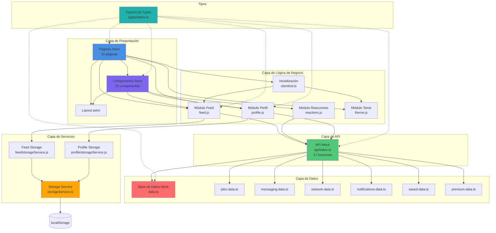

---

## Flujo de Datos

Este diagrama muestra cómo fluyen los datos a través de la aplicación.

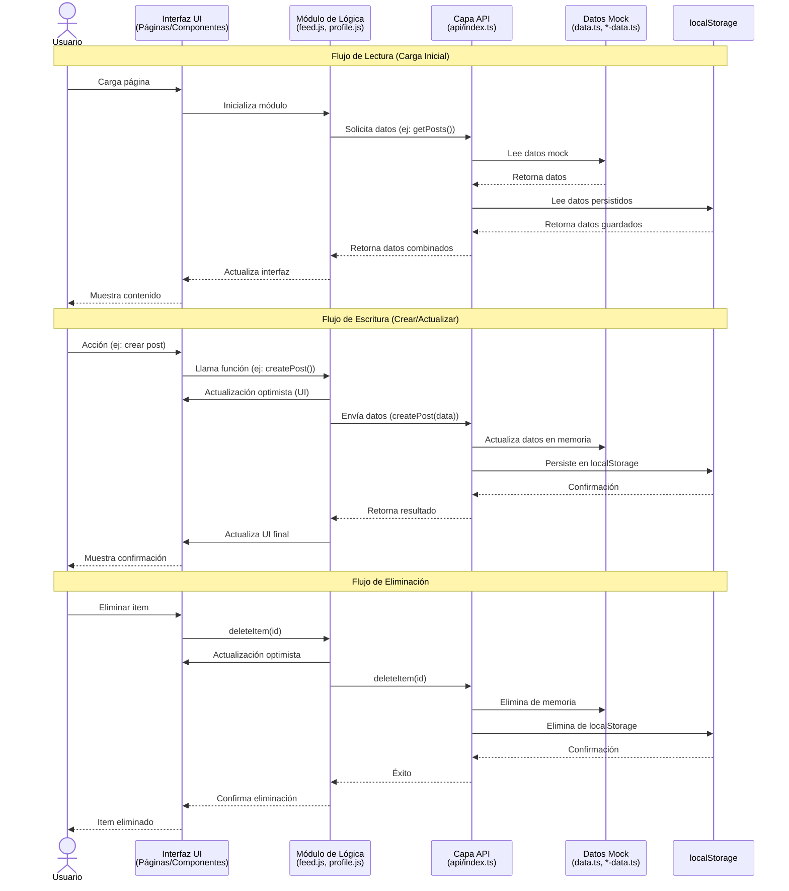

---

## Arquitectura por Capas

Este diagrama muestra la arquitectura en capas del sistema y las dependencias entre ellas.

```mermaid
graph BT
    subgraph "L1: Persistencia"
        LS[localStorage<br/>Navegador]
    end
    
    subgraph "L2: Servicios de Almacenamiento"
        SS[storageService.ts<br/>Operaciones CRUD<br/>localStorage]
        FSS[feed/storageService.js<br/>Gestión Feed]
        PSS[profile/storageService.js<br/>Gestión Perfil]
    end
    
    subgraph "L3: Fuentes de Datos"
        MockDB[data.ts<br/>Base de datos mock<br/>posts, users, comments]
        JobsD[jobs-data.ts<br/>Listado empleos]
        MsgD[messaging-data.ts<br/>Conversaciones]
        NetD[network-data.ts<br/>Conexiones]
        NotifD[notifications-data.ts<br/>Notificaciones]
        SavedD[saved-data.ts<br/>Guardados]
        PremD[premium-data.ts<br/>Features Premium]
    end
    
    subgraph "L4: Capa API"
        API[api/index.ts<br/>17 funciones API<br/>getPosts, createPost,<br/>updateProfile, etc.]
    end
    
    subgraph "L5: Lógica de Negocio"
        Feed[feed.js<br/>Lógica feed<br/>reorder, filter]
        React[reactions.js<br/>Sistema reacciones]
        Prof[profile.js<br/>Gestión perfil<br/>CRUD skills/exp]
        Theme[theme.js<br/>Dark/Light mode]
        Init[clientInit.ts<br/>Inicialización]
    end
    
    subgraph "L6: Componentes Reutilizables"
        Nav[Navigation Components]
        FeedC[Feed Components]
        ProfC[Profile Components]
        JobsC[Jobs Components]
        MsgC[Messaging Components]
        NetC[Network Components]
        NotifC[Notification Components]
        Util[Utility Components]
    end
    
    subgraph "L7: Páginas"
        Index[index.astro]
        Profile[profile.astro]
        Jobs[jobs/*.astro]
        Messages[messages/*.astro]
        Network[network/*.astro]
        Other[Otras páginas]
    end
    
    subgraph "L8: Layout"
        Layout[Layout.astro<br/>Estructura común]
    end
    
    SS --> LS
    FSS --> LS
    PSS --> LS
    
    API --> MockDB
    API --> JobsD
    API --> MsgD
    API --> NetD
    API --> NotifD
    API --> SavedD
    API --> PremD
    API --> SS
    
    Feed --> API
    React --> API
    Prof --> API
    Feed --> FSS
    Prof --> PSS
    
    Init --> Feed
    Init --> Theme
    
    Nav --> Theme
    FeedC --> Feed
    FeedC --> React
    ProfC --> Prof
    
    Index --> FeedC
    Index --> Nav
    Profile --> ProfC
    Profile --> Nav
    Jobs --> JobsC
    Jobs --> Nav
    Messages --> MsgC
    Messages --> Nav
    Network --> NetC
    Network --> Nav
    Other --> Util
    Other --> Nav
    
    Index --> Layout
    Profile --> Layout
    Jobs --> Layout
    Messages --> Layout
    Network --> Layout
    Other --> Layout
    
    style L1 fill:#ff6b6b
    style L2 fill:#ffa500
    style L3 fill:#ffd700
    style L4 fill:#50c878
    style L5 fill:#4a90e2
    style L6 fill:#7b68ee
    style L7 fill:#ff69b4
    style L8 fill:#20b2aa
```

---

## Flujos de Usuario Principales

### 1. Crear una Publicación

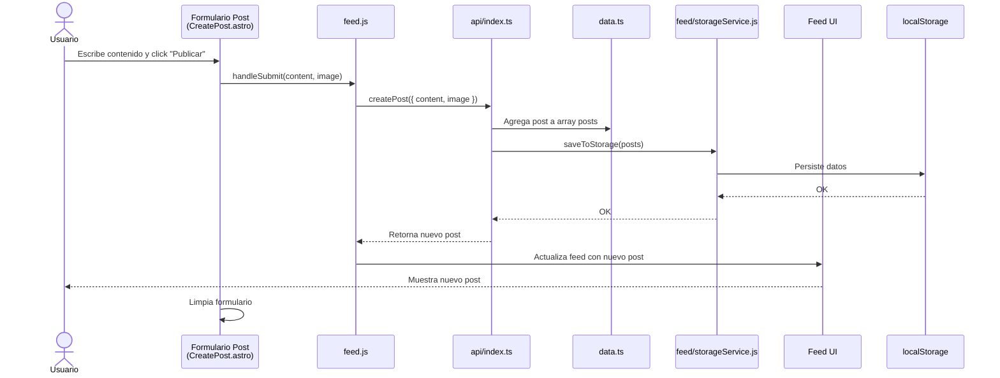

### 2. Dar una Reacción

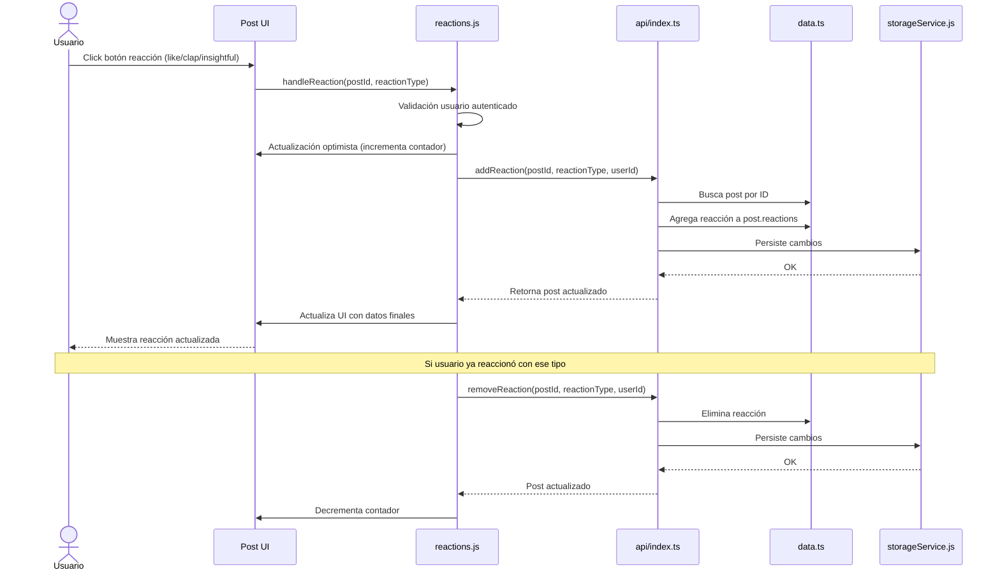

### 3. Editar Perfil (Agregar Habilidad)

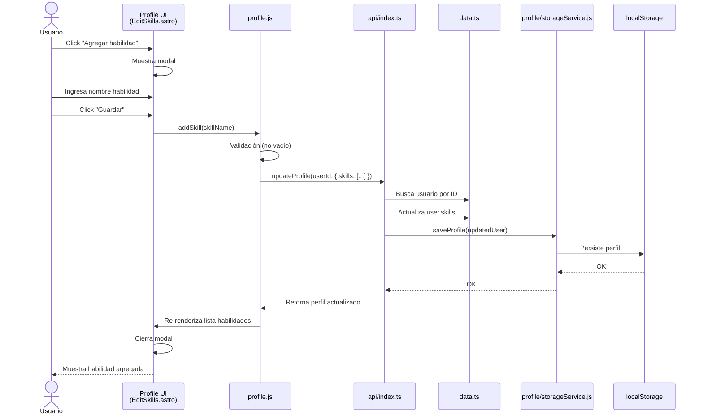

### 4. Aplicar a un Empleo

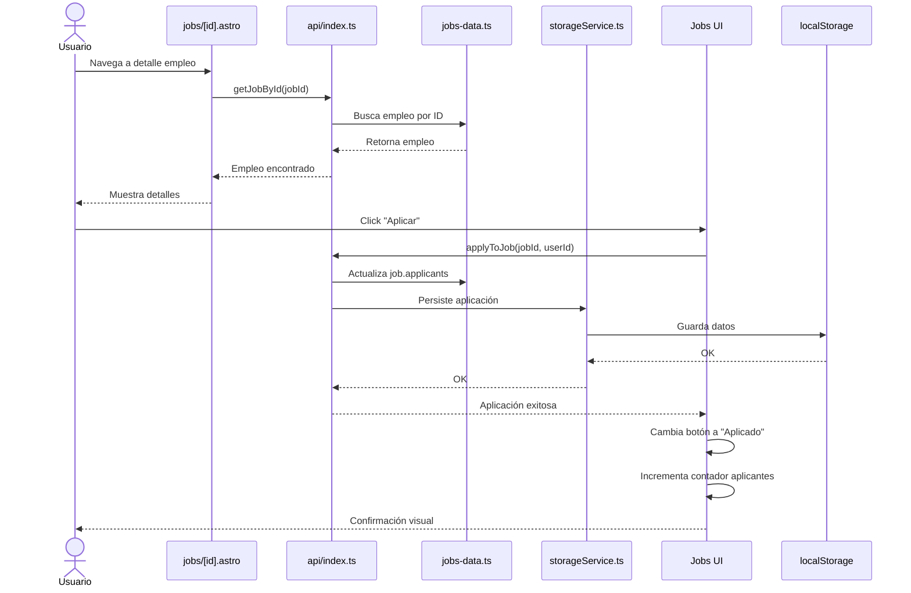

### 5. Enviar Mensaje

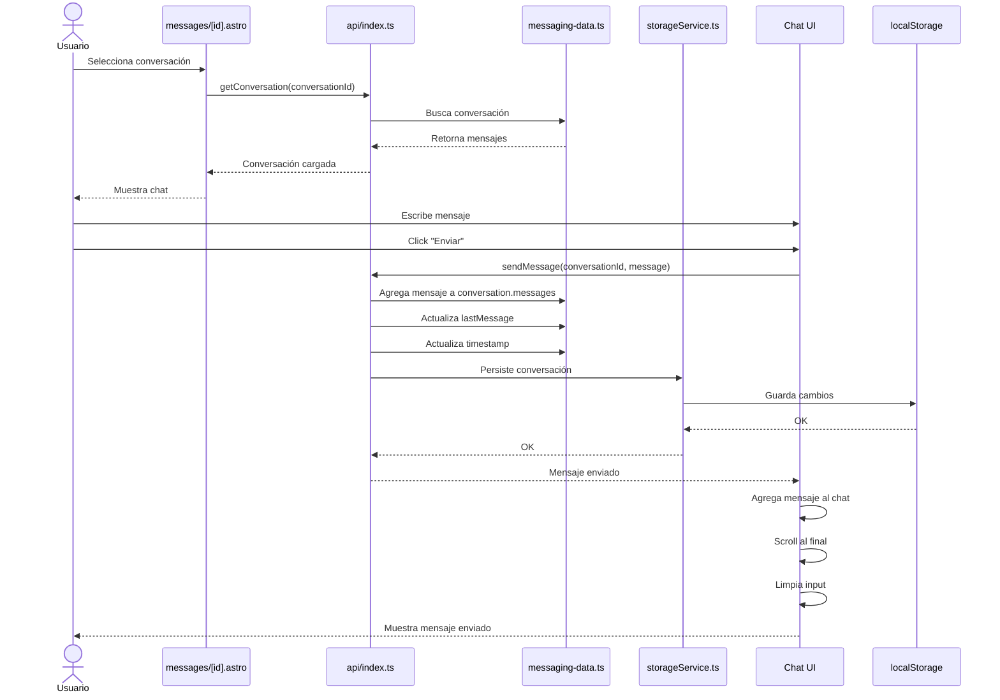

### 6. Cambiar Tema (Dark/Light)

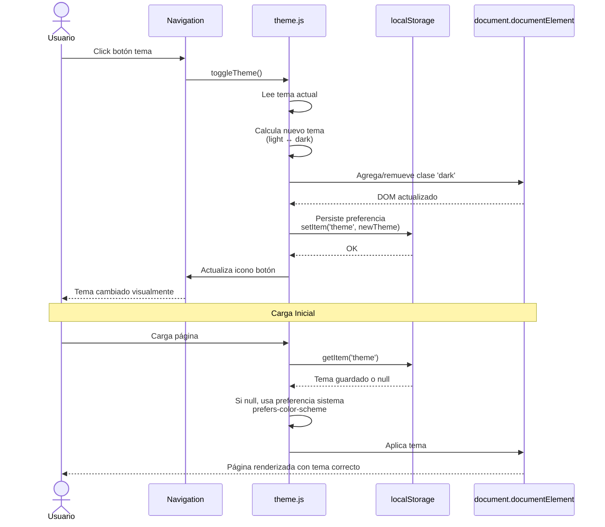

---

## Patrones de Arquitectura Utilizados

### 1. **Repository Pattern**
- **Implementación**: `storageService.ts`, `feed/storageService.js`, `profile/storageService.js`
- **Propósito**: Abstrae las operaciones de persistencia (localStorage)
- **Beneficio**: Facilita cambiar localStorage por una API real

### 2. **Mock API Pattern**
- **Implementación**: `api/index.ts` con funciones async que simulan latencia
- **Propósito**: Simular backend mientras se desarrolla frontend
- **Beneficio**: Todo listo para reemplazar con API real

### 3. **Module Pattern**
- **Implementación**: Módulos de lógica de negocio (`feed.js`, `profile.js`, `reactions.js`)
- **Propósito**: Encapsular lógica relacionada
- **Beneficio**: Código organizado y reutilizable

### 4. **Optimistic UI Pattern**
- **Implementación**: En `feed.js` y `reactions.js`
- **Propósito**: Actualizar UI antes de confirmar con backend
- **Beneficio**: Mejor experiencia de usuario (respuesta inmediata)

### 5. **Event Delegation Pattern**
- **Implementación**: En scripts de componentes Astro
- **Propósito**: Minimizar event listeners usando data attributes
- **Beneficio**: Mejor rendimiento, menos memoria

### 6. **Layered Architecture**
- **Capas**: Presentación → Lógica → API → Datos → Servicios
- **Propósito**: Separación de responsabilidades
- **Beneficio**: Código mantenible y escalable

---

## Dependencias entre Módulos

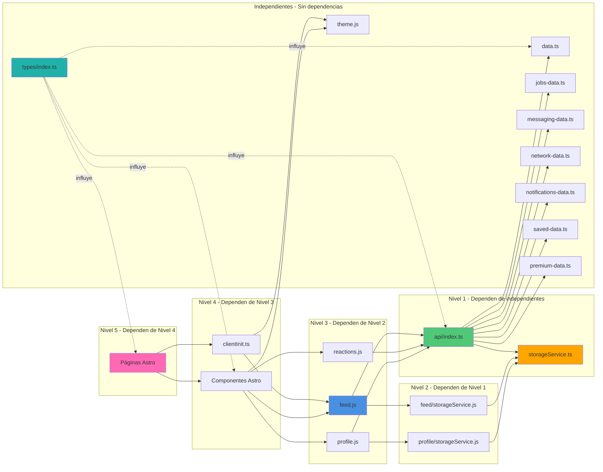

---

## Puntos de Integración para Backend Real

Cuando se desee integrar un backend real, estos son los puntos clave a modificar:

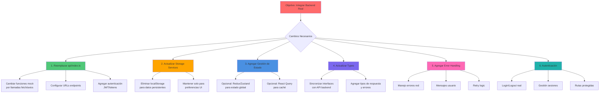

---

## Resumen de Arquitectura

### Características Clave

1. **Arquitectura en Capas**: Separación clara de responsabilidades
2. **API Mock**: Facilita desarrollo sin backend
3. **Persistencia Local**: localStorage con servicios abstractos
4. **Componentes Modulares**: 22 componentes reutilizables
5. **Routing File-Based**: Astro gestiona rutas automáticamente
6. **TypeScript**: Tipado fuerte en toda la aplicación
7. **Optimistic UI**: Actualizaciones inmediatas para mejor UX
8. **Event Delegation**: Rendimiento optimizado
9. **Dark Mode**: Soporte completo con persistencia

### Estadísticas del Proyecto

- **Total de Páginas**: 22 (16 estáticas + 6 dinámicas SSR)
- **Total de Componentes**: 22 (organizados por feature)
- **Total de Módulos JS/TS**: 17 (lógica de negocio)
- **Funciones API**: 17 (listas para backend real)
- **Interfaces TypeScript**: 20+ (tipado completo)
- **Archivos de Datos**: 7 (datos mock organizados)
- **Capas de Arquitectura**: 8 (separación responsabilidades)

### Tecnologías Principales

- **Framework**: Astro 5.16.9
- **Styling**: TailwindCSS 4.1.18
- **Language**: TypeScript 5.9.3
- **Persistencia**: localStorage (temporal)
- **Patrón**: Repository + Mock API + Layered Architecture

---

## Conclusión

Este proyecto demuestra una arquitectura bien estructurada y escalable, lista para integración con un backend real. La separación en capas, el uso de patrones de diseño modernos y la organización modular facilitan el mantenimiento y la extensión del sistema.

**Próximos pasos recomendados**:
1. Integrar autenticación real
2. Conectar con API backend
3. Implementar gestión de estado global (opcional)
4. Agregar tests unitarios e integración
5. Configurar CI/CD pipeline
